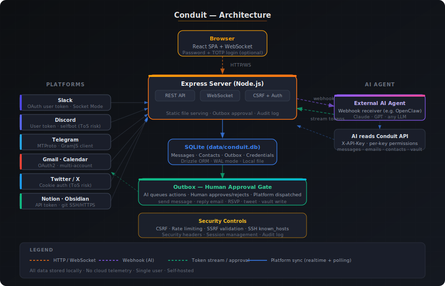

<div align="center">
  
</div>

<br/>

A self-hosted personal communications hub. Aggregates Slack, Discord, Telegram, Gmail, Google Calendar, and Twitter/X into a single unified interface, and exposes a full REST API for AI agent integration — running locally on Node.js with SQLite storage.

<br/>

## Platforms

| Platform | What's supported |
|---|---|
| **Slack** | Messages, DMs, channels, realtime via Socket Mode, unread tracking |
| **Discord** | Messages, DMs, server channels, guild sync, unread tracking |
| **Telegram** | Private messages, groups, channels, MTProto realtime, folder sync |
| **Gmail** | Full inbox, email body, actions (reply, archive, trash, etc.) |
| **Google Calendar** | Events, RSVP, create/update/delete, Meet links |
| **Twitter / X** | DMs, home feed, mentions, search, tweet analytics |
| **Notion** | Page and database browsing, content reads |
| **Obsidian** | Vault sync via git (SSH or HTTPS), file read/write via outbox |

---

## Features

- **Unified inbox** — everything new across all platforms at a glance
- **Chat** — message threads with bubble UI, avatars, unread badges, infinite scroll
- **Contacts** — cross-platform contact list with activity scoring and message history
- **Email** — Gmail inbox with sandboxed HTML rendering and action buttons
- **Calendar** — weekly view, event detail, RSVP
- **AI agent API** — full REST + OpenAPI spec, designed for tool use by LLMs
- **Outbox approval** — all AI-generated actions queue for human review before sending
- **Audit log** — complete history of all actions by actor and service
- **Password + TOTP 2FA** — optional browser login with rate limiting and session management
- **Multi-account Gmail** — connect multiple Google accounts simultaneously
- **Self-hosted, local-first** — SQLite database, no cloud dependencies, no telemetry

---

## Quick start

```bash
git clone https://github.com/conduit-app/conduit
cd conduit
npm install
make dev
```

Open **http://localhost:3101** and configure services from the Settings page. All credentials are entered in the UI — no config files required.

---

## Docker

```bash
make docker-up    # build image and start
make docker-down  # stop
```

The SQLite database persists in `./data/` on the host and survives container rebuilds.

---

## AI agent integration

Conduit exposes a complete REST API for AI tool use, accessible at `http://localhost:3101/api`.

**Setup:**
1. Go to **Settings → Permissions** and generate an API key
2. Pass `X-API-Key: <your-key>` on every request
3. Copy the connection config from **Settings → Install** and paste it into your agent

The full OpenAPI spec is at `/api/openapi.json`. A human-readable version is in [`docs/api.md`](docs/api.md).

**Outbox flow:** All AI write actions (send message, reply to email, RSVP, tweet, vault write) create an outbox item with `status=pending`. A human approves or rejects it in the UI before anything is sent.

---

## Architecture

<div align="center">
  
</div>

**Stack:** Node.js 20 · Express · SQLite (better-sqlite3) · Drizzle ORM · React · Vite · Tailwind CSS · TypeScript throughout.

---

## Security

Conduit is a **single point of failure** for every account you connect. The local database stores credentials and session tokens for all connected platforms. If the database is accessed by an unauthorized party, all connected accounts are exposed simultaneously.

**Steps to harden your instance:**

1. Enable **password + 2FA login** in Settings → Security
2. Restrict network access to the server (firewall, VPN, or localhost-only binding)
3. Protect `data/conduit.db` from unauthorized file system access
4. Set `TRUST_PROXY=true` only if running behind a reverse proxy you control

**Security controls implemented:**
- Optional password login (bcrypt, cost 12) + TOTP 2FA with rate limiting
- API key auth (SHA-256 hashed) with per-key, per-service permission grants
- CSRF protection (double-submit cookie) for all UI session requests
- SSRF validation on outbound webhook and git remote URLs
- `X-Content-Type-Options`, `X-Frame-Options`, `Referrer-Policy`, and CSP headers
- SSH strict host key checking (configurable) with stored known_hosts
- Audit log for all actions

See [SECURITY.md](SECURITY.md) for the responsible disclosure policy and known accepted risks.

---

## Platform terms of service

Several connection methods may conflict with platform ToS. Review each platform's terms before connecting.

| Platform | Access method | Risk |
|---|---|---|
| **Discord** | User token (selfbot) | Account suspension possible — not an official bot integration |
| **Twitter / X** | Cookie / credential auth | Account suspension possible — no official API key used |
| **Telegram** | MTProto (official client API) | Low risk under normal personal use |
| **Slack** | Official OAuth user token | Low risk |
| **Gmail / Google Calendar** | OAuth2 (official API) | Low risk |
| **Notion** | Official integration token | Low risk |
| **Obsidian** | Local git repository | No external account risk |

By connecting a platform, you accept that risk entirely.

---

## Development

```bash
make dev      # start server (port 3100) + Vite dev server (port 3101)
make build    # production build
make migrate  # run database migrations
make test     # run server tests
make lint     # typecheck both packages
```

In development, Vite runs on port `3101` and proxies API calls to the server on port `3100`. In production, the server serves both API and UI on port `3101`.

---

## Configuration

Conduit has no configuration files. All credentials are entered through the web UI.

| Variable | Default | Description |
|---|---|---|
| `PORT` | `3101` | Server listen port |
| `DATABASE_PATH` | `data/conduit.db` | Path to the SQLite database file |
| `TRUST_PROXY` | _(unset)_ | Set to `true` to trust `X-Forwarded-*` headers from a reverse proxy |
| `DOCKER` | _(unset)_ | Set to `true` in Docker to adjust update behaviour |

---

## Disclaimer

**By installing or running Conduit, you accept full responsibility for your use of this software. The authors make no warranties and accept no liability for any consequences, including account suspension, data loss, or security incidents.**

You are solely responsible for securing the host machine, restricting network access, enabling login protection, and protecting the database file.
